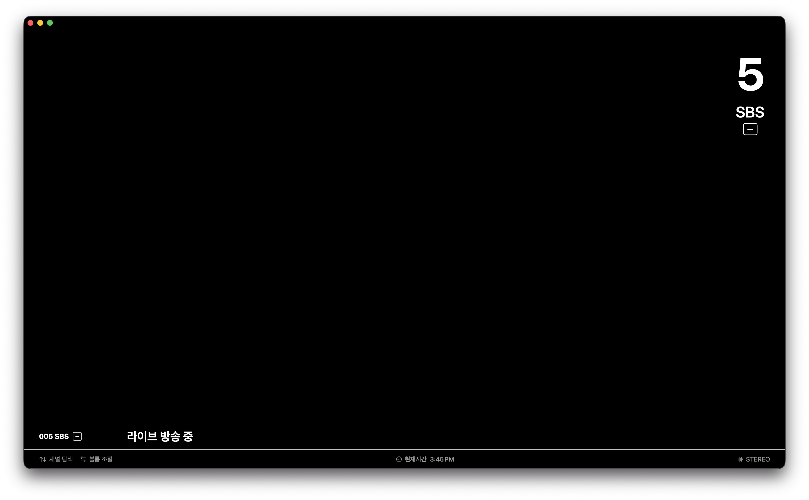

# M3U8 Player

macOS용 HLS(M3U8) IPTV 플레이어입니다.  
IPTV 스타일의 UI를 갖추고, 키보드만으로 채널 전환과 볼륨 조절이 가능합니다.

---

## 스크린샷



---

## 요구 사항

| 항목 | 버전 |
|------|------|
| macOS | 26.0 이상 |
| Xcode | 16.0 이상 |
| Swift | 6.0 |

---

## 설치 및 실행

### 1. 저장소 클론

```bash
git clone https://github.com/your-username/m3u8_player.git
cd m3u8_player
```

### 2. 채널 파일 생성

예시 파일을 복사해 실제 URL을 입력하세요.

```bash
cp Sources/M3U8Player/Channels.json.example Sources/M3U8Player/Channels.json
```

`Channels.json` 형식:

```json
[
  {
    "name": "채널명",
    "url": "https://example.com/stream/playlist.m3u8",
    "number": 1,
    "category": "카테고리"
  }
]
```

### 3. Xcode에서 열기

```bash
open M3U8Player.xcodeproj
```

Xcode에서 **Run (⌘R)** 을 누르면 바로 실행됩니다.

---

## 키보드 조작

| 키 | 동작 |
|----|------|
| `↑` / `↓` | 채널 탐색 (이전 / 다음) |
| `←` / `→` | 볼륨 조절 (-5% / +5%) |
| `0` – `9` | 채널 번호 직접 입력 (1.8초 후 전환) |
| 화면 클릭 | 채널 정보 배너 토글 |

---


## 프로젝트 구조

```
m3u8_player/
├── Sources/M3U8Player/
│   ├── M3U8PlayerApp.swift      # 앱 진입점
│   ├── ContentView.swift        # 전체 UI 및 PlayerController
│   ├── Models.swift             # Channel 모델, JSON 로딩
│   ├── Channels.json            # ❌ Git 제외 — 실제 채널 URL
│   └── Channels.json.example   # ✅ Git 포함 — 템플릿
├── M3U8Player.xcodeproj/
├── project.yml                  # XcodeGen 설정
└── .gitignore
```

---

## 기술 스택

- **SwiftUI** — 선언형 UI (macOS 26, Swift 6)
- **AVFoundation** — `AVPlayer` + `AVPlayerLayer` (기본 HUD 비활성화)
- **`@Observable`** — `PlayerController` 상태 관리
- **KVO** (`NSKeyValueObservation`) — 채널 전환 시 실제 해상도 1회 관찰

---

## 라이선스

MIT
